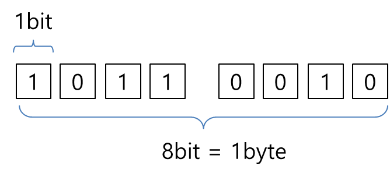

# 코어 자바스크립트 Part 1. 데이터 타입

## 목차

- [코어 자바스크립트 Part 1. 데이터 타입](#코어-자바스크립트-part-1-데이터-타입)
  - [목차](#목차)
    - [데이터 타입의 종류](#데이터-타입의-종류)
    - [메모리와 데이터](#메모리와-데이터)
    - [변수와 식별자](#변수와-식별자)
    - [변수 선언과 데이터 할당](#변수-선언과-데이터-할당)
    - [기본형 데이터와 참조형 데이터](#기본형-데이터와-참조형-데이터)
    - [불변 객체](#불변-객체)
    - [없음을 나타내는 값](#없음을-나타내는-값)

### 데이터 타입의 종류

자바스크립트의 데이터 타입은 크게 `기본형(primitive type)`과 `참조형(reference type)` 두 가지로 구분된다. 참조형에는 객체(object)가 있고 배열, 함수, 날짜 그리고 ES6에서 추가된 Map과 Set 등은 객체의 하위분류에 속한다.

- `기본형`

  - Number
  - String
  - Boolean
  - null
  - undefined
  - Symbol

- `참조형`
  - Array
  - Function
  - Date
  - RegExp
  - Map, WeakMap
  - Set, WeakSet

### 메모리와 데이터



0과 1로 표현할 수 있는 하나의 메모리 조각을 `비트(bit)`라고 한다. `메모리`는 많은 비트들로 구성되어 있으며 비트마다 부여된 `고유 식별자(unique identifier)`를 통해서 그 위치를 확인할 수 있으며 이를 `메모리 주솟값(memory address)`이라고 부른다. 그런데 0이나 1만 표현할 수 있는 비트의 단위로 위치를 확인하는 것은 수많은 연산을 거쳐야 하므로 검색 시간이 오래 걸린다.

조금 더 효율적으로 메모리 위치를 확인할 수 있는 방법은 없을까? 만약 비트를 한 단위로 묶는다면 검색 시간을 줄일 수도 있고 표현 가능한 데이터의 개수도 늘어나겠지만, 동시에 낭비되는 비트가 생길 것이다.

이렇게 비트가 낭비되는 것을 막고자 `바이트(byte)`라는 단위가 생겼다. 8개의 비트가 1개의 바이트로 구성되어 있다.

가장 `첫 번째`로 시작하는 비트의 식별자를 통해 즉, `메모리 주솟값(memory address)을` 통해 효율적으로 메모리의 위치를 파악할 수 있다.

- 8비트는 1바이트이다. ( 1byte = 8bit )
- 메모리 주솟값을 통해 메모리 위치를 빠르고 효율적으로 확인할 수 있다.

### 변수와 식별자

**변수**는 `변할 수 있는 데이터`이다. 더 나아가서 `변경 가능한 데이터가 담길 수 있는 공간`을 말한다. **식별자**는 해당 데이터를 식별하는 이름 즉, `변수명`을 뜻한다.

### 변수 선언과 데이터 할당

아래와 같은 코드는 메모리에 어떻게 담기게 될까?

```js
let color = "blue";
```

**[ 변수 영역 ]**

| 주소       | <center>1002                | 1003 | 1004 |
| ---------- | --------------------------- | :--: | :--: |
| **데이터** | 이름 : color <br>값 : @5004 | ...  | ...  |

**[ 데이터 영역 ]**

|    주소    | 5002 | 5003 | 5004 |
| :--------: | :--: | :--: | :--: |
| **데이터** | ...  | ...  | blue |

1. 컴퓨터는 비어있는 메모리 공간을 확보하고 해당 공간의 이름(식별자)을 `color`라고 지정한다. **(변수의 선언)**
2. 데이터를 저장하기 위한 별도의 메모리 공간을`(@5004)` 확보하고 문자열(blue)을 저장한다.
3. 변수 영역에서 color라는 식별자를 검색하고`(@1002)`, 앞서 데이터 영역에 저장한 문자열(blue)의 주소`(@5004)`를 변수 영역의 값`(@1002)`에 대입해서 연결한다. **(데이터 할당)**

**데이터 재할당**

```js
let color = "blue";
color = "red";

console.log(color); // `red`
```

| 주소       | <center>1002                | 1003 | 1004 |
| ---------- | --------------------------- | :--: | :--: |
| **데이터** | 이름 : color <br>값 : @5005 | ...  | ...  |

**[ 데이터 영역 ]**

|    주소    | 5002 | 5004 | 5005 |
| :--------: | :--: | :--: | :--: |
| **데이터** | ...  | blue | red  |

console.log로 color를 확인해보면 결과는 `red`로 출력된다. 기존의 `(@5004)`의 데이터 값을 수정한 것이 아니라, `red`라는 새로운 문자열을 별도의 공간`(@5005)`에 저장하고 변경된 데이터 주소를 다시 변수 공간에 연결했기 때문이다. 이처럼 컴퓨터가 변수 영역과 데이터 영역을 나눠서 관리하는 이유는 데이터 변환을 자유롭게 할 수 있게 함과 동시에 메모리를 효율적으로 관리하기 위함이다.

### 기본형 데이터와 참조형 데이터

**불변값**

- 변수(variable)와 상수(constant)는 `변경 가능성의 여부`에 따라서 구분 지을 수 있다.
- 한 번 데이터 할당이 이뤄진 `변수 영역`에 재할당이 가능하면 `변수(var/let)`, 불가능하면 `상수(const)`이다.
- 불변값을 판단할 때의 변경 가능성 여부는 `데이터 영역`의 메모리이다.
- 불변값과 상수는 같은 개념이 아니다. 워딩 사용에 주의해야 한다.

**기본형 데이터는 불변값이다.**

```js
let a = "abc";
a = a + "def";

// 기존 데이터 영역의 값 `abc`가 `abcdef`로 변경되는 것이 아니다.
// 새로운 문자열 `abcdef`를 만들고 그 주소를 변수 a의 값에 재할당한 것이다.
// 결국 `abc`와 `abcdef`는 서로 다른 별개의 데이터이다.

let b = 5;
let c = 5;
b = 7;

// 변수 b에 5를 할당한다. 컴퓨터는 먼저 데이터 영역에서 5를 검색한다.
// 5가 없으면 새로운 데이터 공간을 만들고 5를 저장한다.
// c가 할당되면 컴퓨터는 데이터 영역에서 5를 검색하는데, 앞에서 이미 만들어 놓은 값이 존재한다.
// 다시 값을 할당하지 않고, 이미 할당된 5를 재활용한다.
// b에 7이 할당되면 컴퓨터는 데이터 영역에서 7을 검색한다.
// 할당된 적 없는 새로운 값이니, 새로운 공간에 7을 저장한다.
// 변수 영역의 값을 7이 저장되어 있는 주소로 변경한다.
// 아래의 console.log 결과처럼 결국 5와 7을 모두 다른 값으로 바꿀 수 없다.

console.log(a); // 'abcdef'
console.log(b); // 7
```

- 기본형 데이터는 값을 변경할 수 없다. (가비지 컬렉팅을 당하지 않는 한 절대 변하지 않는다.)

  즉, 불변값은 한 번 만들어진 값이 영원히 변하지 않는다는 것이다.

- 변경은 새로운 추가를 통해서만 이루어진다.

  값이 변경되는 것은 새로운 값이 할당되었다는 뜻이다.

**참조형 데이터는 가변값이다.**

> 기본적인 성질은 가변값인 경우가 많지만 설정에 따라 변경 불가능한 경우도 있고, 불변값으로 만들 수도 있다.

참조형 데이터는 어떻게 메모리에 담기게 될까?

```js
let obj = {
  name: "sounghyun",
  age: "27",
};
```

**[ 변수 영역 ]**

| 주소       | <center>1002               | 1003 | 1004 |
| ---------- | -------------------------- | :--: | :--: |
| **데이터** | 이름 : obj1 <br>값 : @5001 | ...  | ...  |

**[ 데이터 영역 ]**

|    주소    |   5001    |  5002  | 5003 |
| :--------: | :-------: | :----: | :--: |
| **데이터** | @7103 ~ ? | 'hyun' |  27  |

**[ 객체 @5001의 변수 영역 ]**

|    주소    |           7103            |           7104           |    7105     |
| :--------: | :-----------------------: | :----------------------: | :---------: |
| **데이터** | 이름 : name<br>값 : @5002 | 이름 : age<br>값 : @5003 | <center>... |

1. 컴퓨터는 먼저 변수 영역의 빈 공간`(@1002)`를 확보하고, 그 주소의 식별자를 `obj`로 지정한다.

2. 데이터 영역의 빈 공간`(@5001)`에 데이터를 저장하려고 보니 여러 개의 `프로퍼티`로 이뤄진 데이터 그룹이다. 이 그룹의 내부 프로퍼티들을 저장하기 위해 `별도의 변수 영역`을 마련하고, 그 영역의 주소`(@7103 ~ ?)`를 `@5001`에 저장한다.
3. `@7103` 과 `@7104`에 각각 `name`과 `age`라는 프로퍼티 이름을 지정한다.
4. 데이터 영역에서 `sounghyun`이라는 값을 검색한다. 검색 결과가 없으므로 새로운 데이터 영역 `@5002`에 저장하고 이 주소를 `@7103`에 저장한다.
5. 데이터 영역에서 `27`이라는 값을 `@5003`에 저장하고 이 주소를 `@7104`에 저장한다.

**기본형과 참조형의 차이**

기본형 데이터와 참조형 데이터의 차이는 `객체의 변수(프로퍼티) 영역`이 별도로 존재한다는 것이다. 위의 테이블을 보면, 객체가 별도로 할애한 영역은 변수 영역일 뿐 `데이터 영역`은 기존의 메모리 공간을 그대로 활용하고 있다. `데이터 영역`에 저장된 값은 모두 불변값이지만, 변수에는 얼마든지 다른 값을 대입할 수 있다. 이 부분 때문에 참조형 데이터는 불변하지 않는 가변값이라고 한다.

**즉, `새로운 객체`가 만들어지는 것이 아니라 기존의 객체 내부의 값만 바뀌는 것.**

**중첩 객체**

> 참조형 데이터의 프로퍼티에 다시 참조형 데이터를 할당하는 경우를 말한다.

```js
let obj = {
  x: 3,
  arr: [3, 4, 5],
};
```

**[ 변수 영역 ]**

| 주소       | <center>1002               | 1003 | 1004 |
| ---------- | -------------------------- | :--: | :--: |
| **데이터** | 이름 : obj2 <br>값 : @5001 | ...  | ...  |

**[ 데이터 영역 ]**

|    주소    |   5001    | 5002 |   5003    | 5004 | 5005 |
| :--------: | :-------: | :--: | :-------: | :--: | :--: |
| **데이터** | @7103 ~ ? |  3   | @8104 ~ ? |  4   |  5   |

**[ 객체 @5001의 변수 영역 ]**

|    주소    |          7103          |           7104           |    7105     |
| :--------: | :--------------------: | :----------------------: | :---------: |
| **데이터** | 이름 : x<br>값 : @5002 | 이름 : arr<br>값 : @5003 | <center>... |

**[ 배열 @5003의 변수 영역 ]**

|    주소    |          8104          |          8105          |          8106          |
| :--------: | :--------------------: | :--------------------: | :--------------------: |
| **데이터** | 이름 : 0<br>값 : @5002 | 이름 : 1<br>값 : @5004 | 이름 : 2<br>값 : @5005 |

**obj.arr[1]을 검색하면 메모리에서는 어떤 과정을 거칠까?**

`@1002` -> `@5001` -> `(@7103~?)`-> `@7104`->` @5003` -> `(@8104 ~?)` ->`@8105`-> `@5004`-> `4` 반환

**재할당**

```
obj.arr = 'str';
```

- 새로운 데이터 영역(`@5006`)에 문자열 'str'을 저장하고, 그 주소를 @7104에 저장한다.
- `@5003`은 더이상 자신의 주소를 참조하는 변수가 하나도 없게 된다. <br>(어떤 데이터에 대해 자신의 주소를 참조하는 변수의 개수를 이를 참조 `카운트`라고 부른다.)
- `@5003`의 참조 카운트는 `@7104`에 저장되었던 시점까지는 1이었으나 `@5006`이 저장되는 순간 0이 된다.
- 참조 카운트가 0인 메모리 주소는 `가비지 컬랙터(garbage collector)`의 수거 대상이 된다.

**가비지 컬렉터(garbage collector)**

가바지 컬렉터는 런타임 환경에 따라서 특정 시점이나 메모리 사용량이 `포화 상태`에 임박할 때마다 자동으로 수거 대상들을 `수거(collecting)`한다. 수거된 메모리는 다시 새로운 값을 할당할 수 있는 빈 공간이 된다.

**변수 복사 비교**

> 기본형 데이터의 복사

```js
// 복사 이후의 값 변경
let a = 10;
let b = a;
b = 15;

console.log(a, b); // 10, 15 -> a !== b
```

**기본형 데이터의 변수 복사를 하면 기존의 값과 복제한 값은 서로 다른 값이 된다.**

> 참조형 데이터의 복사

```js
// 복사 이후의 값 변경
// - 객체의 프로퍼티 변경 시
let obj1 = { c: 10, d: "ddd" };
let obj2 = obj1;
obj2.c = 20;

console.log(obj1, obj2); // { c: 20, d: 'ddd' } -> obj1 === obj2

// - 객체 자체 변경 시
obj2 = { c: 20, d: "ddd" };

console.log(obj1, obj2); // { c: 10, d: 'ddd' } { c: 20, d: 'ddd' }
```

**참조형 데이터의 가변은 내부 프로퍼티를 변경할 때만 성립된다.**

### 불변 객체

> 불변 객체는 값으로 전달받은 객체에 변경을 가하더라도 객체 자체는 변하지 않아야 할 경우에 필요하다.

**얕은 복사**

- 바로 아래 단계의 값만 복사하는 방법이다.
- 프로퍼티에 대한 원본과 사본은 모두 동일한 참조형 데이터 주소를 가리키게 된다.
- 사본을 바꾸면 원본도 바뀌고, 원본을 바뀌면 사본도 바뀐다.

**깊은 복사**

- 내부의 모든 값을 하나하나 찾아서 전부 복사하는 방법이다.
- 어떤 객체를 복사할 때 객체 내부의 모든 값을 복사해서 완전히 새로운 데이터를 만들고자 할 때, 객체의 프로퍼티 중에서 그 값이 기본형 데이터일 경우에는 그대로 복사하면 되지만 참조형 데이터는 다시 그 내부의 프로퍼티들을 복사해야 한다.
- 깊은 복사를 간단하게 처리할 때 객체를 JSON 문법으로 표현된 문자열로 전환했다가 다시 JSON 객체로 바꾸면 깊은 복사가 된다. 단, 메서드나 숨겨진 프로퍼티인 proto나 getter/setter 등과 같이 JSON으로 변경할 수 없는 프로퍼티들은 모두 무시된다.

**참조형 데이터를 불변값으로 사용하는 방법**

- 내부 프로퍼티들을 일일이 복사 (깊은 복사)
- 혹은 라이브러리 사용(immutable.js, baobao.js)

### 없음을 나타내는 값

없음을 나타내는 값은 두 가지가 있다.

- undefined

  - undefined의 경우 사용자가 명시적으로 지정할 수 있지만, 자바스크립트 엔진이 자동으로 부여하는 경우도 있다. 자바스크립트 엔진이 부여하는 경우는 사용자가 어떤 값을 지정할 것이라도 예상되는 상황임에도 실제로 그렇게 하지 않았을 때 `undefined`를 반환한다.

    - 값을 대입하지 않은 변수
    - 객체 내부의 존재하지 않는 프로퍼티에 접근하려고 할 때
    - return 문이 없거나 호출되지 않는 함수의 실행 결과

- null
  - null은 사용자가 비어있음을 명시적으로 나타내고 싶을 때 사용한다. null은 사용자가 직접 할당하지 않는 이상 나올 수 없는 값이다.
