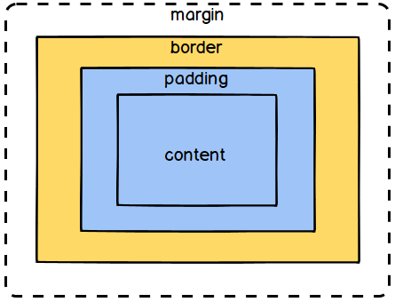

# CSS 박스 모델(Box Model)

문서상의 요소들을 시각적인 목적을 위해서 모든 요소를 하나의 **직사각형 박스**로 여기는 모델이다. 모든 박스는 아래의 영역으로 구성되어 있다.

- 콘텐츠 영역(Content Area) : 글이나 이미지, 비디오 등 요소의 실제 내용을 포함한다.
- 안쪽여백 영역(Padding Area) : 안쪽여백 경계(Padding Edge)가 감싼 영역으로 컨텐츠 영역을 요소의 안쪽 여백까지 포함하는 크기로 확장한다.
- 테두리 영역(Border Area) : 테두리 경계(Border Edge)가 감싼 영역으로, 안쪽여백 영역을 요소의 테두리까지 포함하는 크기로 확장한다.
- 바깥여백 영역(Margin Area) : 바깥여백 경계(Margin Edge)가 감싼 영역으로, 테두리 영역을 확장해 요소와 인근 요소 사이의 빈 공간까지 포함하도록 한다.

## box-sizing

`box-sizing` 속성을 사용하면 `width`와 `height`가 콘텐츠 영역을 기준으로 하는지, 테두리 영역을 기준으로 하는지 지정할 수 있다.

- `box-sizing:content-box` : 기본값이며 콘텐츠 영역 기준이다. 즉, 안쪽 여백 영역부터 포함하지 않는다.
- `box-sizing:border-box` : 테두리 영역 기준이며 바깥 여백 영역부터 포함하지 않는다. **쉽게 얘기해서 `padding` 값이 들어가도 크기가 커지지 않는다.**

## 참고

- [MDN, CSS 기본 박스 모델 입문](https://developer.mozilla.org/ko/docs/Web/CSS/CSS_Box_Model/Introduction_to_the_CSS_box_model)
